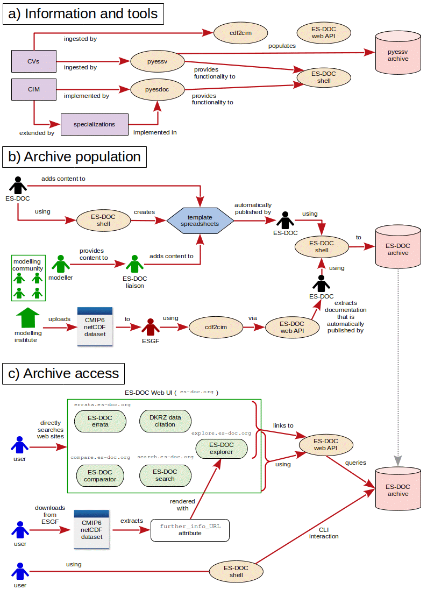

# Architecture

## Summary

The foundation of the ES-DOC (Earth System Documentation) project is a mature
software ecosystem that facilitates both the provision and the consumption of
CMIP6 workflow documentation streamlining and where possible, automating, the
various and often complex stages involved in the overall workflow. It manages
the full life cycle of CMIP6 CIM (CIM2) documents.

The toolchain comprises an interrelated set of diverse libraries, services and
storage solutions. The core user-facing asset is a website hosted with
WordPress, supported by dedicated servers and databases on WebFaction, which
consolidates the web applications and maps them onto domains. The software
ecosystem and further stores contained in GitHub repositories under the
‘ES-DOC' organisation enables content pushed by modelling institutes to
repositories under another organisation, ‘ES-DOC-INSTITUTIONAL’, to be
processed into CIM2 documents, stored, and displayed on the Wordpress website
for discovering, viewing and comparing.

The back-end software stack comprises several Python-based utility libraries
to automate creation and/or publication of relevant standardised documents
and to store and systemise semantics for applicable controlled vocabularies,
models, and ontologies; content storage through archive repositories on
GitHub and through five databases on WebFaction; and a shell-script library
to facilitate development using  these tools on the poly-repository system.
The front-end stack consists of Python web services to manage documentation
and errata stored in the WebFaction databases, for generating and publishing
the model documentation, and for rewriting various URLs; and JavaScript (Vue
framework) web applications that support the viewing, searching, and
comparing of the published documentation, as well as serving and displaying
other relevant content.

**Figure 1:** workflows showing the key steps involved under the ES-DOC
architecture in getting the content from modellers, the documentation
providers, to users (i.e. consumers of CMIP data), via core storage archives.
The stages of composition and setup for the intermediate tooling chain and
the life cycle of model documents are also included. **1a)** depicts the
incorporation of standards into ES-DOC software tools, which may provide
for other tools, resulting in some endpoint tools which play one or more
direct role(s) in the archive population and access. **1b)** shows the
population into the ES-DOC archive of content originating from the
modelling community, and **1c)** illustrates how the data stored there can be
consumed by downstream users by three distinct routes. In each case,
relevant (groups of) people or ‘actors’ *[torso symbols]* or informational
standards *[purple boxes]* act as inputs and interact with each other, with
data content in netCDF *[dataset symbols]* and template files
*[blue hexagons]*, and with various elements of the ES-DOC software stack
*[beige ovals]* including web-based user interface (UI) components
*[green rounded boxes]* and attributes *[white round box]* in-browser.

## The tooling chain, storage, and hosting

Figure **(1a)** illustrates how various semantic standards are taken in by
ES-DOC software libraries leading to tools that are utilised directly by
actors in the archive population and consumption workflows (covered in
subsequent sections), as well as the collection of controlled vocabularies
into the ``pyessv-archive`` (see section 'The back-end software stack').

#### Collecting standards as a starting point

The effective start point for the entire workflow which takes documentation
from producers to consumers are semantic standards which define a rich set
of artefacts to describe all aspects of numerical experiments and their
requirements in a consistent and rigorous manner. These are the Common
Information Model (CIM) updated for CMIP6, CIM 2.X (currently 2.1 with
proposals set out for 2.2, CIM2 for short), the model specialisations
which further constrain the generic CIM2 for application once at the
top-level and then to each CMIP6 realm, and other controlled vocabularies
(henceforth CVs) which define other constraints on the properties outlined
in the CIM2. Some of these further CVs are defined by ES-DOC to support
ES-DOC applications but most are pulled from the core CMIP6 set managed
by the WCRP-CMIP group as systemised in their
['WCRP-CMIP/CMIP6_CVs' GitHub repository](https://github.com/WCRP-CMIP/CMIP6_CVs),
and some also stem from ESGF or specific institutions.

The CIM2 is composed from two separate software entities: the schema
[``esdoc-cim-v2-schema``](https://github.com/ES-DOC/esdoc-cim-v2-schema) which
models CMIP6 specifically (contrast this to the ``esdoc-cim-v1-schema``
specific to CMIP5’s CIM1) through a small number (~10) of Python modules
containing functions which encode the CIM classes, enumerations and
entities; and the so-called conceptual CIM or “ConCIM”
[``esdoc-cim``](https://github.com/ES-DOC/esdoc-cim) which sets out the
notional artefacts in functions also arranged in some Python modules.
The ConCIM ingests the CIM2 schema modules to form a supplemented schema
we refer to henceforth as the CIM(2). It is ultimately a group of simple
and static Python data structures.

The CIM forms the basic conceptual data model, but to fully document a
configured model composed of “realms” (e.g. atmosphere, ocean, land surface,
etc.) the defined properties need to be customised on a realm-by-realm
basis. This is encapsulated in “specialisations”, which are Python modules
stored under community-owned separate micro-repositories for each of the
eight official CMIP6 realms plus the top-level set (which as an example is
found in in the repository
[``cmip6-specializations-toplevel``](https://github.com/ES-DOC/cmip6-specializations-toplevel).
A specialisation file typically defines numerous ordered key-value pairs
encoding the metadata (via the Python ``OrderedDict`` data type) for ‘details’
and enumerations which extend the properties of the CIM. The specialisation
repositories also contain code to generate their content as JSON so that
further downstream they can be transformed using pyesdoc (see the next
sub-section) to HTML pages and rendered at the front-end as content viewable
separately to the simulation-related documentation (under the domain
[https://specializations.es-doc.org/](https://specializations.es-doc.org/) e.g.
[https://specializations.es-doc.org/cmip6/ocean](https://specializations.es-doc.org/cmip6/ocean).

#### The back-end software stack

The [``pyessv``](https://github.com/ES-DOC/pyessv) library takes the WCRP
CMIP6 CVs from their repository as well as INI files from ESGF and (amongst
other roles) validates and serialises them as JSON, populating the
[pyessv-archive](https://github.com/ES-DOC/pyessv-archive) with these as
written out in a notation defined and understood by pyessv. It is also
used downstream in
[``esdoc-cdf2cim``](https://github.com/ES-DOC/esdoc-cdf2cim),
i.e. the "cdf2cim" library, which is used predominantly to map netCDF files to
CIM documents via the creation and manipulation of intermediate JSON
structures holding the metadata from the netCDF headers of all published
CMIP6 datasets. Note that cdf2cim has its own archive to store that
intermediate JSON (see the ‘Storage’ section below).

The Python client at the heart of the ES-DOC toolchain is referred to as the
"pyesdoc" library, though note it is contained under a different repository
name in [``esdoc-py-client``](https://github.com/ES-DOC/esdoc-py-client). It
implements the supplemented CIM2 schema to conduct a number of core tasks
relating to CIM2 documents, for example validating them against the schema,
archiving them, and publishing them to the ES-DOC web service. A supplemental
tool that is similar in function is
[``pyosl``](https://github.com/ES-DOC/pyosl),
which defines a metamodel for the manipulation of a general ontology and
provides methods and tools to do so.

Together, pyessv and pyesdoc provide functionality that is coordinated by
the ES-DOC shell, ``esdoc-shell``, into a diverse set of commands for
performing the myriad of operations that are required across the life cycle
of a CIM(2) document. The ES-DOC shell is ultimately what is utilised
directly by the ES-DOC team for management of the ecosystem.

Finally, the ES-DOC Web API, implemented in
[``esdoc-api``](https://github.com/ES-DOC/esdoc-api), is a self-contained
library that exposes the various endpoints of the web applications
delivered by ES-DOC, as covered further in the content consumption section.

### Servers and hosted components

The infrastructure for ES-DOC is deployed with some third-parties, notably
the software hosting platform GitHub, the hosting service WebFaction and
the content management system WordPress.

The ES-DOC software libraries and institutional raw content live in
repositories under the [‘ES-DOC’](https://github.com/ES-DOC) and
[‘ES-DOC-INSTITUTIONAL’](https://github.com/ES-DOC-INSTITUTIONAL)
organisations, respectively, on GitHub. The web assets and databases are
hosted on servers provided by WebFaction. Two machines are rented off
WebFaction, one for production and the other for testing; and
five databases: one MySQL database for the WordPress site
and two PostgreSQL databases for each server to hold
content (see below). Finally, the ES-DOC WordPress account holds some static
content which puts the web services and applications into context by
providing information, explanatory diagrams and user guides on
the ES-DOC project at [https://es-doc.org](https://es-doc.org) including
on CMIP6 specifically at
[https://es-doc.org/cmip6/](https://es-doc.org/cmip6/).

### Storage

There are several artefacts which necessitate permanent storage and they
are stored and updated as required either in dedicated archival
mono-repositories on GitHub or in the databases on WebFaction.

Data stored in this manner, and their locations, are: all standard
vocabularies as converted to pyessv notation within the pyessv-archive; all
published cdf2cim intermediate content encoded in the JSON format within
[``esdoc-cdf2cim-archive``](https://github.com/ES-DOC/esdoc-cdf2cim-archive);
all final model documentation as published CIM documents within the
[``esdoc-archive``](https://github.com/ES-DOC/esdoc-archive); all errata in
one pair (one each for production and testing) of the PostgreSQL databases;
all of the (MIPs) experiments documentation in the other pair; and finally
snapshots for the current state of institutional content, in per-institute
repositories (49 at time of writing) under ‘ES-DOC-INSTITUTIONAL’ which tend
to be named with lower-case acronyms, e.g. ``ipsl`` for the Institut
Pierre-Simon Laplace.

## The role of ES-DOC in content provision

Figure **(1b)** conveys the means by which raw metadata content provided by
modellers is converted to CIM2 documents that are stored in the ES-DOC
archive, ready for consumption. There are two approaches that each of the
various institutes making up the modelling community can choose from to
upload their content as a starting point.

The first approach centres around spreadsheets as the format for input and
submission of documentation. The starting point in this case is the ES-DOC
team, who design numerous template spreadsheets to present in an intuitive
and user-friendly way the information required, as delineated in CIM2 and
the specialisations, to document distinct aspects of the modelling workflow,
namely the citations, ensembles, experiments, institutes, models,
responsible parties and (still in development, but soon) the conformances,
machines and associated performances.

When the ES-DOC team are happy with the design concept for a given template,
they create a skeleton spreadsheet with an chosen number of tabs having
chosen column headings etc. ready to hold the relevant text and then use
the ES-DOC shell utility to populate it with the documentation artefacts
from the relevant class(es) in ``esdoc-cim-v2-schema``, such that each item
includes an appropriate number of data entry fields, along with guidance
and per-item descriptions, so all required items may be entered
systematically. The final version of the generated templates are committed
to the relevant directory in the [cmip6](https://github.com/ES-DOC/cmip6)
repository, and code is included with each template
spreadsheet so that the inputs in the data fields in each can be extracted
and serialised into intermediate JSON.

Once a given template spreadsheet is stored in the cmip6 repository, the
ES-DOC shell can be used to make and commit copies of it to the same
location in every institutional repository in ‘ES-DOC-INSTITUTIONAL’, often
so that it is also populated on a case-by-case basis with some
institution-specific content to put it into more context.

At this stage, the availability of the spreadsheets in question are
advertised to the modelling institutions who are free to fill them in and
submit them via committing back to their repository. They are encouraged to
submit in a timely manner but ultimately the timing, frequency, order, and
grouping of submission are up to them. The key actors in the completion and
submission of spreadsheets are the ES-DOC liaisons for each institute. These
are a small number of people (usually just one) per institute who are
appointed to be responsible for organising the submission of the CMIP6
documentation for their group. Overall, they provide a small and
well-defined interface between the modelling community and the ES-DOC team.

Once institutes have, under the instructions of their liaison, committed
filled-out spreadsheets to their GitHub repository, the ES-DOC shell checks
their configuration files to see if a ‘publish’ field has been set to ‘on’,
which indicates that the group would like to publish the subset of content
managed by that configuration file (e.g. for the citations or conformances
spreadsheets separately, or only for particular model realms) they have in
their repository. In the case publication has been activated, the ES-DOC
back-end system has been configured to automatically (at least in the sense
of very soon, on the scheduled next cron job) update the published CIM
documents with corresponding changes, and ingest these into the ES-DOC archive.

This publication process, beginning with code in the cmip6 repository
extracting and serialising to JSON the items in the input fields from the
committed spreadsheets, and concluding with cdf2cim converting them to the
CIM documents which are published and ingested, is automated using the
ES-DOC shell and cron jobs to define and schedule updates, respectively.

The alternative pathway to content provision and document creation is
bespoke to the documentation of enembles of CMIP6 simulations, and is an
automated process that derives the documentation from netCDF files during
the ESGF publication phase. This is the lowermost path shown in **(1b)**.

This functionality uses cdf2cim and the ES-DOC web API and is installed as
part of the standard
[ESG Publisher stack](https://github.com/ESGF/esg-publisher), and simply
needs to be enabled and configured by an ESGF node manager. On the node,
ES-DOC’s cdf2cim is used to scan sets of all  netCDF datasets from the
local file system as they are published extracting the metadata from these
and serialising it all into a single JSON structure (often referred to by
the ES-DOC developers as a JSON “blob”) per applicable simulation.

When the institute is ready to upload all CMIP6 metadata contained in a
collection (or even just one) of these JSON simulation records, they make
another call to cdf2cim within the ESG Publisher framework which uses a
special handler, the CMIP6 Handler, to push all records from a given
directory to the ES-DOC server. Successful server upload in this manner
requires, notably, passing validation against the CIM2 schema and on the
correct authorisation credentials having been configured by the institute
and recognised.

Once on the server-side, the ES-DOC Web API will, in an automatic process
configured and controlled using the ES-DOC shell, take all known JSON blobs
and convert them into the appropriate number of CIM documents which it
publishes to the ES-DOC archive.

There is a third approach that may be used instead of the two described, but
for CMIP6 this is only being used by the UK Met Office for model
documentation. For this method, the modelling institute stores their own,
bespoke database of documentation and uses pyesdoc to map its contents to
CIM documents. These documents can then be published by the modelling
institute itself. Once the latency of developing an in-house database
system has been overcome, this method can be used to create and publish
documentation with minimal effort.

## The role of ES-DOC in content consumption

See Figure **(1c)** for an outline of the steps by which end-users can access
any of the documentation which gets produced via the documentation provision
workflow covered in the previous section. Note there are three distinct
(main) pathways which can be taken. Each route may be more suitable in a
given context and/or by preference of the consumer.

### Web User Interface (UI) and its connection with related web services

The first and most visible inlet for documentation consumption is ES-DOC’s
sophisticated browser-based user interface or ‘Web UI’, which has a landing
page domain of es-doc.org. Under this root domain, there are various web
services that provide applications which are mapped to specific domains.

The core ES-DOC web assets accessible from there are applications that
enable end-users to search, explore and compare documentation across all
models. The latter application, the so-called ‘comparator’ at
[https://compare.es-doc.org](https://compare.es-doc.org), only provides, at
the time of writing, comparisons for CMIP5 models as implemented in the
``esdoc-web-compare`` repository. Extensions to provide functionality for
CMIP6 models are still in the early stages of development. Therefore at
present the two core assets are the search application, which originates from
the [``esdoc-web-search``](https://github.com/ES-DOC/esdoc-web-search)
repository and is available at
[https://search.es-doc.org](https://search.es-doc.org), and the ‘explorer’
stemming from the
[``esdoc-web-explorer``](https://github.com/ES-DOC/esdoc-web-explorer)
repository and found at the domain
[https://explore.es-doc.org](https://explore.es-doc.org).

The search application is designed to enable users to quickly discover
published documentation, which (when fully developed) will allow sifting
for CMIP6 by document type, version (‘latest’ or any), and MIP (if
applicable), and links for a selected item to the viewer application
([https://view.es-doc.org](https://view.es-doc.org)) which displays the
document in a user-friendly way. The explorer is
ultimately envisioned as a single application to
integrate all of the others, however for the moment it complements the
search application by making model documentation discoverable. Note also
that the explorer hosts the Further Info URL pages (see below for details).
Finally, the comparator, when ‘live’ for CMIP6 (an analogous application
for CMIP5 is fully built and currently renders on the aforementioned
comparator domain), will allow one to compare the various scientific
properties across published models and their components. Results of this
comparison will be (as well as visually indicated) serialised such that
users can copy or export them.

There are two further major web resources which ES-DOC interfaces to,
namely services for management and dissemination of errata and of data
citation.

The Errata System, which is coordinated with ESGF, aims to track known
issues and amendments in data that has been published in a timely manner.
ES-DOC makes the errata from this system accessible and searchable
by an application mapped to the domain [errata.es-doc.org](errata.es-doc.org)
by means of three libraries, ``esdoc-errata-fe``, ``esdoc-errata-client``
and ``esdoc-errata-ws`` which provide the front-end,
client utility and web service implementations respectively (as reflected
in the names).

The (CMIP6 Data) Citation Service is managed by DKRZ and hosted outside of
the ES-DOC web UI, with documentation at
[http://cmip6cite.wdc-climate.de.](http://cmip6cite.wdc-climate.de.)
However, it is intrinsically connected to the ES-DOC front-end ecosystem
because the Citation Service provides the Further Info URL landing pages
(see next section).

Note that the ES-DOC Web API may also be accessed directly through GET
requests on the documented endpoints, i.e. without going via the web UI,
for external applications. This is achieved for example in the external
toolkit
[``esdoc4scientists``](https://https://github.com/bnlawrence/esdoc4scientists)
created to allow scientists to generate tables for their publications.

#### The Further Info URL landing page and attribute

The second main route for accessing published metadata is a bottom-up
approach via the so-called Further Info URL, which is a landing page for
the documentation of any CMIP6 simulation containing all documentation
registered for a given ensemble of simulations, as well as links to the
documentation for corresponding model and experiment. The URL itself in
each case is formed systematically from components of the CMIP6 data
reference syntax
([DRS](https://www.earthsystemcog.org/site_media/projects/wip/CMIP6_global_attributes_filenames_CVs_v6.2.6.pdf)
in a strict order, which for CMIP6 will be
``http://furtherinfo.es-doc.org/CMIP6.<INSTITUTION_ID>.<SOURCE_ID>.<EXPERIMENT_ID>.<SUB_EXPERIMENT_ID>.<VARIANT_LABEL>``, as delineated
[on the ES-DOC website](https://es-doc.org/cmip6-ensembles-further-info-url).
The domain formed from this URL is mapped to the explorer application which
renders the landing page.

The route in this case begins with an end-user inspecting a dataset they
are interested in using a tool of their choosing (for example, with ncdump
on the command line). All CMIP6 netCDF datasets are required to have a
global attribute ``further_info_URL`` which gives the URL discussed
above for the ensemble the dataset belongs to. So by extracting the value
of the ``further_info_URL`` from a dataset, a user can simply copy it into
the browser to access the landing page and from that, either directly or
via following the links contained within, find any and all metadata
relating to their dataset.

#### ES-DOC shell as an advanced access route

The third and final core route, shown from the lowermost user in Figure
**(1c)**, is for an end-user to utilise ES-DOC libraries via the ES-DOC
shell in the same manner that the ES-DOC team does for operations. Namely,
they could execute various commands established by the library to perform
operations towards consumption of relevant documents. The command set
includes some dedicated CMIP6 commands and ones to, for instance, uncompress
archived documents or run the web API in an interactive terminal session.
