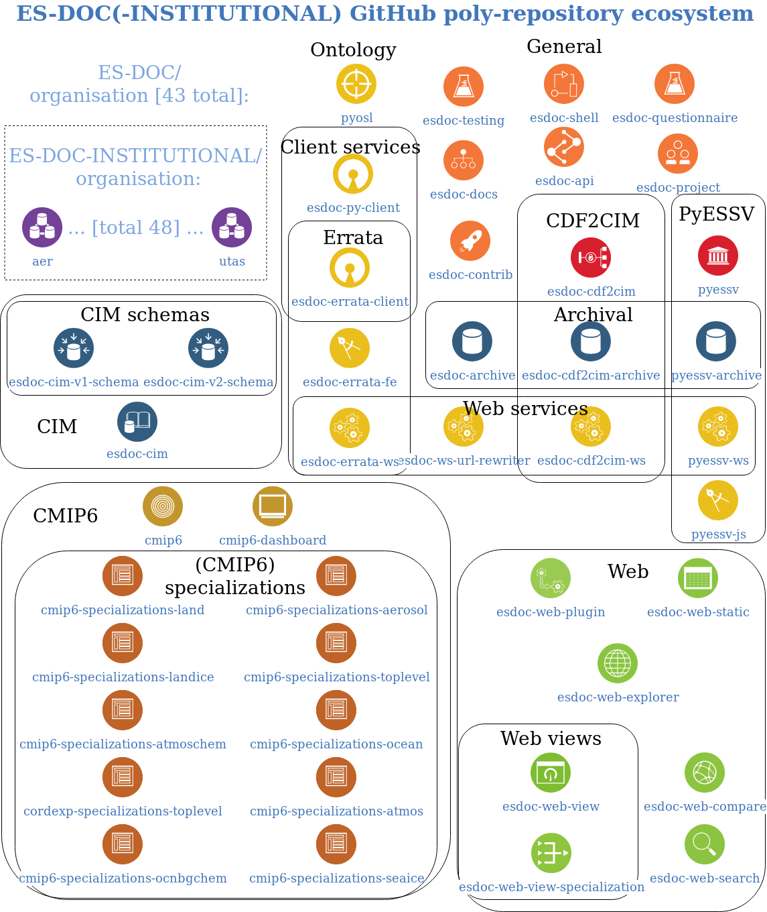

# GitHub

## Scope

These notes cover ... [TODO]

## Basics

* We make use of two GitHub 'organisations':
  * [`ES-DOC`](https://github.com/ES-DOC)
  * [`ES-DOC-INSTITUTIONAL`](https://github.com/ES-DOC-INSTITUTIONAL).

* At the time of writing, there are 43 repositories under `ES-DOC` & 48 under
  `ES-DOC-INSTITUTIONAL`, giving a total of `91`.

* Most of the `ES-DOC` repositories are in use.

* There are scripts to automatically create and manage the teams under
  `ES-DOC-INSTITUTIONAL`, where the members of the organisation are mainly
  the node data providers for the various institutions.

* There is also a `esdoc-system` user account.

## Ecosystem diagram [WIP]

Here is a visual arrangement showing the various GitHub repositories for
the ES-DOC project, aiming to display related groups of repositories &
indicate the general purpose of each repository:

