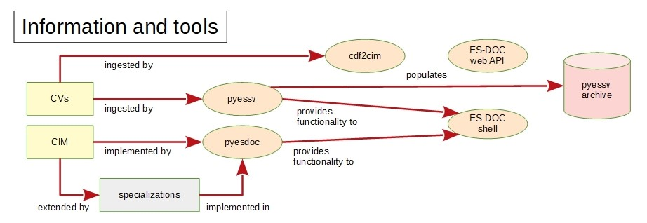
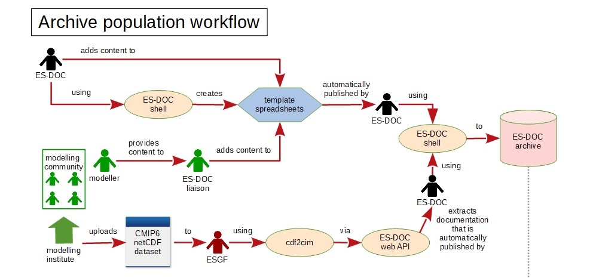
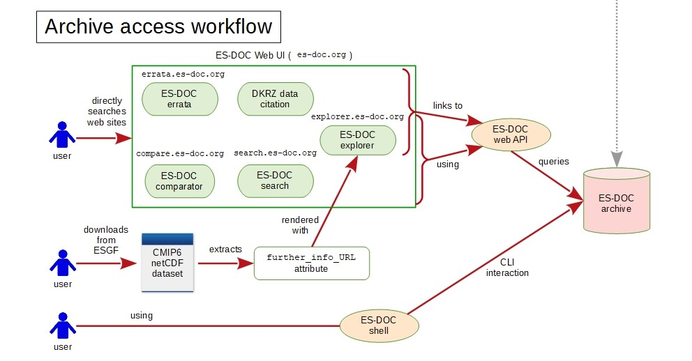

# Workflow

## Scope

* overview of the software, services, tools, utilities & actors (etc.) that
  make up the ES-DOC ecosystem;
* the processes that tie them together.

## About the whole process

* ES-DOC is in fact a very difficult project since there are lots of:
  * "moving parts";
  * documents involved;
  * sociological aspects (we can't tell the modelling community what to do,
    notably force them to document their work in our system and to do so in
    time for when we want them to).

## Information & Tools workflows

## Archive workflows

### Archive population by the modelling community

### Archive access by users

